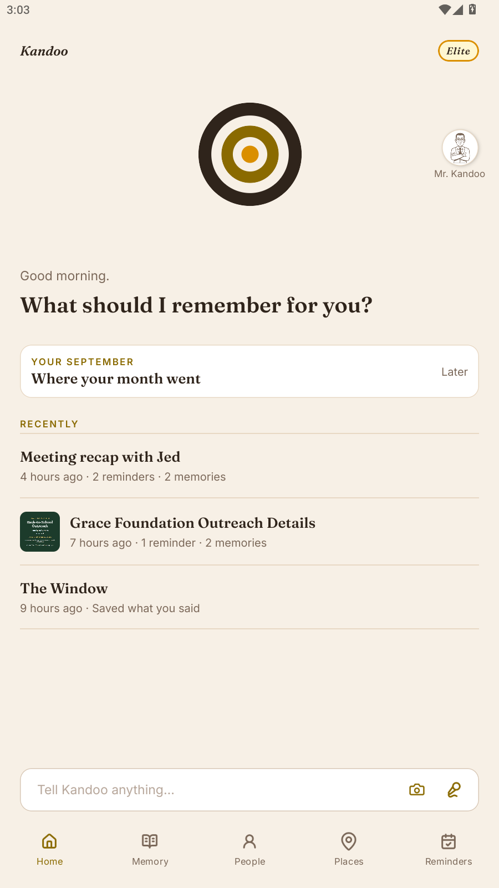
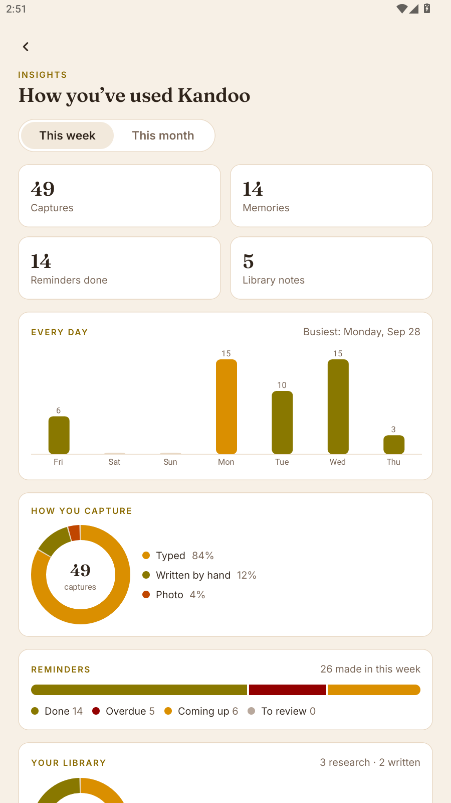
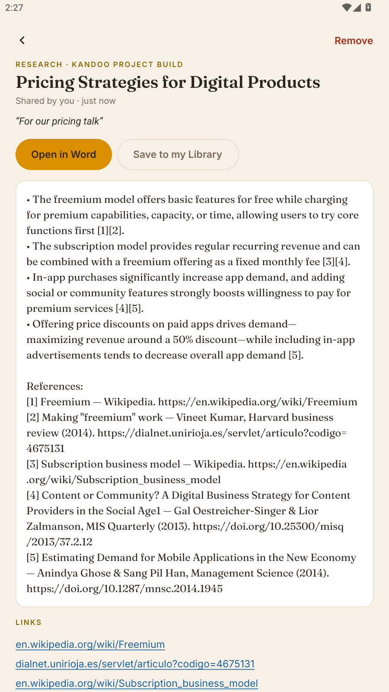
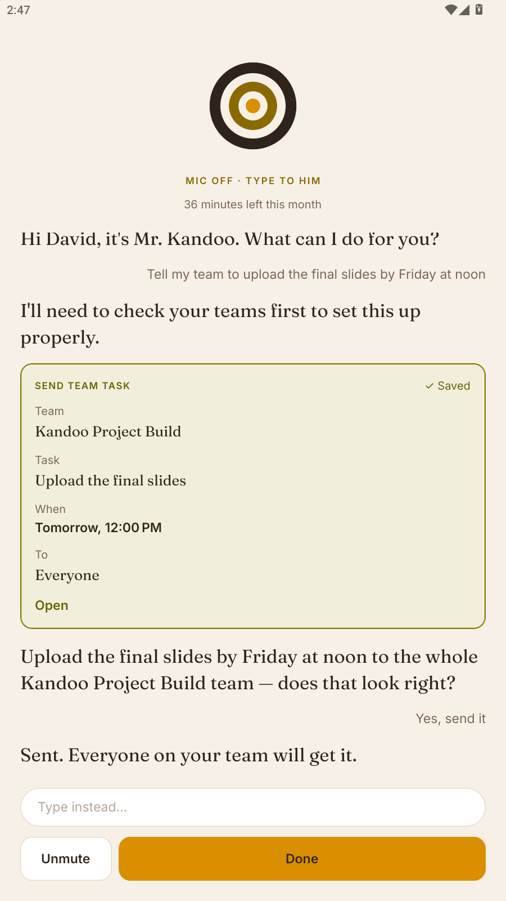
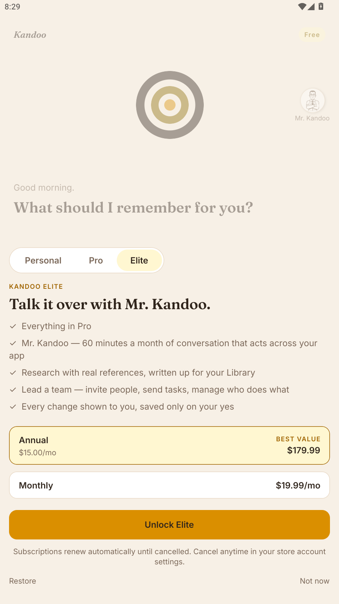

# Kandoo

**Tell Kandoo once. It remembers when it matters.**

Kandoo is a memory and action assistant for Android. You speak naturally — a
messy recap after a meeting, a thought on the walk home, a photo of a flyer —
and it works out the people, places, times and commitments inside it, keeps
what matters, and brings it back when it matters: at the right time, the
moment you arrive somewhere, or when you ask.

Built for the **RevenueCat Shipaton 2026 — Next Gen Award**.

**Watch the demo:** [youtu.be/2wiwBygtu-8](https://youtu.be/2wiwBygtu-8)  
**See everything Kandoo can do:** [greatman-david.github.io/kandoo](https://greatman-david.github.io/kandoo/)

[](https://youtu.be/2wiwBygtu-8)

| | | | | |
|---|---|---|---|---|
|  |  |  |  |  |

---

## The mark

Kandoo's symbol is **Adinkrahene**, the Adinkra symbol from Ghana known as the
"chief" of the Adinkra symbols — concentric circles standing for greatness,
leadership and the idea at the centre of everything else. For Kandoo it is the
one place everything you've told it comes back to.

---

## How it works

One loop, everywhere in the app:

```
CAPTURE  →  UNDERSTAND  →  LINK  →  SURFACE
```

1. **Capture.** Speak, type, photograph something, or talk to Mr. Kandoo. The
   raw words are saved verbatim and never overwritten.
2. **Understand.** A model turns one utterance into *many* structured actions —
   memories, reminders and questions. A single meeting recap produces several
   of each.
3. **Link.** Each action is tied to who, where and when; memories are embedded
   for search by meaning.
4. **Surface.** Nothing is scheduled until you review it. Once confirmed, the
   phone owns the trigger — a time, or arriving at or leaving a place — so it
   fires even with no connection.

### What's in this build

**Capture and review**
- Voice with a live transcript (pause, resume), typing, or a photo with a caption.
- One utterance becomes many actions; relative times ("before 5", "tomorrow
  morning", "by Friday") are resolved against the phone's own clock.
- Every action arrives as an editable card. Nothing saves without your yes.

**Reminders**
- Local notifications that fire offline; alarms that show over the lock screen.
- Repeat on chosen weekdays, snooze, complete with undo.
- Place reminders: fire on arriving at, or leaving, a place you drew.

**Memory and recall**
- Ask in plain words. Hybrid search (pgvector meaning + Postgres full text)
  across memories, reminders, notes, your Library and your team's files.
- Answers can be spoken. Free answers from the last ten days; paid plans reach
  your whole history (enforced on the server).

**People, places, photos**
- A page per person: what you promised, what you know, their photos; merge
  duplicates ("Mum" and "mother").
- Draw any place on the map. Only the places you drew are watched; location
  never leaves the phone. A monthly recap of where your time went.
- A private photo library kept with the people and places in it.

**Library**
- Notes in categories you name; open any note in Microsoft Word as a real .docx.
- Photograph pages into organised notes, filed for you.
- Research write-ups with numbered, real references (Wikipedia and OpenAlex).

**Insights** — this week or month: day-by-day activity and your busiest day,
how you capture, reminders done/overdue/upcoming, Library by category, and the
people and places that came up most.

**Teams** — join by link or code; share notes, research, PDFs, Word files,
slides and photos, each showing who sent it; search inside shared documents;
leaders send tasks that each member accepts into their own reminders.

**Mr. Kandoo** — a voice agent (ElevenLabs) that holds a conversation and acts
across the whole app through 50 tools that run on the phone. Every change he
makes is a card you approve. His prompt and tool definitions are in
[`docs/mr-kandoo`](docs/mr-kandoo).

### Plans — RevenueCat

| Plan | Price | Adds |
|---|---|---|
| Free | — | Capture, reminders, Library, answers from the last ten days |
| **Personal** | $3.99/mo · $29.99/yr | Whole history, Places, kept photos, Insights, Kandoo's voice |
| **Pro** | $9.99/mo · $79.99/yr | Work tools: pages into notes, Teams as a member |
| **Elite** | $19.99/mo · $179.99/yr | Mr. Kandoo (60 min/month), research, leading a team |

Each plan is a RevenueCat entitlement (`kandoo_personal`, `kandoo_pro`,
`kandoo_elite`); a higher plan's products grant every entitlement below it. The
backend reads entitlements from RevenueCat's V2 REST API, keyed by the Supabase
user id (the app calls `Purchases.logIn` with that id), so a modified client
cannot unlock anything. The paywall opens at the moment a feature is worth
something — a question that reaches past ten days, a tap on Places, Teams or
Mr. Kandoo — on the cheapest plan that unlocks it.

This build uses RevenueCat's **Test Store**, since it is distributed as an APK
rather than through Google Play: purchases are simulated and no money is taken.

### Architecture in brief

```
USER → AI INTERPRETS → BUSINESS LOGIC DECIDES → DATABASE PERSISTS → USER
```

- **The AI is the understanding layer, never the actor.** It returns JSON that
  is validated with Zod; deterministic services act on it. Mr. Kandoo's tools
  only *propose* changes; your yes commits them.
- **The device owns triggers.** Time and place are device facts. Reminders fire
  as local notifications and geofences, with the server offline.
- **Time comes from the device.** Every request carries the phone's clock and
  IANA timezone. For weekdays, the phone checks the date the model chose really
  falls on the day you said.
- **Built to stay up.** If the main model is overloaded, a backup model takes
  over; captures save on the phone first and sync later.

**Stack:** React Native · Expo · TypeScript · Expo Router · Reanimated ·
MapLibre — Node · Express 5 — Supabase (Postgres, pgvector, Auth, Storage) —
Google Gemini via a provider abstraction (OpenAI and a mock provider also
implemented) — ElevenLabs (Mr. Kandoo, spoken answers) — RevenueCat.

### AI provider

Development runs on the Gemini API free tier, which is rate-limited and does
not carry Google's no-training commitment. A production deployment would need
a paid tier (Tier 1 or above) for that guarantee and for real request volume.

---

## Running it

Android only. iOS is out of scope for this release.

### Prerequisites

- **Node 20 or newer**
- Android Studio with the SDK, or an Android emulator (developed against
  [MuMu Player](https://www.mumuplayer.com/); Google's AVD also works)
- A [Supabase](https://supabase.com) project
- A [Google AI Studio](https://aistudio.google.com) API key
- A [RevenueCat](https://www.revenuecat.com) project (Test Store is enough)
- An [ElevenLabs](https://elevenlabs.io) account, for Mr. Kandoo (optional;
  everything else works without it)

### 1. Database

In the Supabase SQL editor, run every file in
[`backend/migrations`](backend/migrations) **in order**, `001` to `013`. Each is
safe to run again.

Storage: migrations `010` and `013` create the private `photos` and
`team-files` buckets. If your project refuses the SQL insert into
`storage.buckets`, create those two buckets (private) in the Storage page.

### 2. Backend

```bash
cd backend
npm install
cp .env.example .env     # then fill it in
npm run dev
```

`backend/.env.example` lists every setting with a comment: Supabase URL and
**service-role** key, Gemini keys and models, RevenueCat secret key and project
id (without them everyone is Free), ElevenLabs key and agent id, and the
public URL used in team invite links. The service-role key must never reach the
mobile app.

The server listens on port 3000. `GET /health` confirms it's up.

### 3. RevenueCat

Create entitlements `kandoo_personal`, `kandoo_pro` and `kandoo_elite`, monthly
and yearly products for each plan (each product attached to its own
entitlement and every one below it), and a current offering with packages
`personal_monthly`, `personal_annual`, `$rc_monthly`, `$rc_annual` (Pro),
`elite_monthly` and `elite_annual`.

### 4. Mr. Kandoo (optional)

Create an ElevenLabs conversational agent, paste
[`docs/mr-kandoo/prompt.md`](docs/mr-kandoo/prompt.md) as its system prompt,
create each tool in [`docs/mr-kandoo/tools.json`](docs/mr-kandoo/tools.json) as a
**client** tool and attach all of them, then put the agent id in
`ELEVENLABS_AGENT_ID`. The prompt expects the dynamic variables `user_name`,
`client_time` and `timezone`, which the app sends.

### 5. Mobile

```bash
npm install
cp .env.example .env     # then fill it in
```

`.env` needs your Supabase URL and **anon/publishable** key, the backend URL,
and `EXPO_PUBLIC_REVENUECAT_KEY` (the RevenueCat public SDK key). From a Google
AVD the host is reachable at `10.0.2.2`, so use
`EXPO_PUBLIC_API_URL=http://10.0.2.2:3000`; with `adb reverse tcp:3000 tcp:3000`
(any emulator, including MuMu) `http://127.0.0.1:3000` works too.

Everything in the root `.env` is inlined into the JS bundle at build time — never
put a secret there. After changing it, restart Metro with `--clear`.

### 6. Build and run

The app uses native modules, so it needs a development build rather than Expo Go.

```bash
npx expo prebuild --platform android
cd android && ./gradlew assembleDebug -x lint -x test -PreactNativeArchitectures=x86_64 --no-parallel
cd ..
adb install -r android/app/build/outputs/apk/debug/app-debug.apk
adb reverse tcp:8081 tcp:8081
npx expo start --clear
```

`-PreactNativeArchitectures=x86_64` builds only the emulator's ABI, which is
several times faster. For a physical phone, build the release APK for all four
ABIs (about 80 minutes the first time):

```bash
cd android && ./gradlew assembleRelease -x lint -x test --no-parallel
```

If you're on MuMu rather than a Google AVD, connect adb first with
`adb connect 127.0.0.1:7555`, and use `adb -s 127.0.0.1:7555` for the install and
reverse commands above.

### Tests

```bash
npm test              # app
cd backend && npm test
```

---

## The acceptance test

Send this as **one** capture:

> Just came out of the meeting with Jed. He's pushing the API migration to Q1
> because of the vendor issue, and the budget got cut by fifteen percent. I need
> to send Michael the spec before 5, and remind me to book the review room
> tomorrow morning.

Kandoo should return **two memories and two reminders** in a single response:
memories atomic and pronoun-resolved ("Jed is pushing…", not "he said…"),
"before 5" resolved to 17:00 today, "tomorrow morning" to 09:00 tomorrow, and
both reminders `pending` until you confirm them.

---

## Status

| | |
|---|---|
| Multi-action extraction and review cards | ✅ |
| Hybrid recall across memories, notes, Library and team files | ✅ |
| Voice capture and spoken answers | ✅ |
| Local reminders (offline, lock-screen alarms, repeats) | ✅ |
| Places: drawn areas, arrive and leave reminders | ✅ |
| People, photos, monthly recap | ✅ |
| Library, page reading, research with references, Open in Word | ✅ |
| Insights | ✅ |
| Teams: files, search, tasks | ✅ |
| Mr. Kandoo voice agent | ✅ |
| Four plans with RevenueCat, enforced on the server | ✅ |
| Google Play release with local pricing | next |
| Kandoo Moments (what happened here last time) | next |

---

## License

MIT — see [LICENSE](LICENSE). The name "Kandoo" and the Adinkrahene mark as used
here identify this project.
